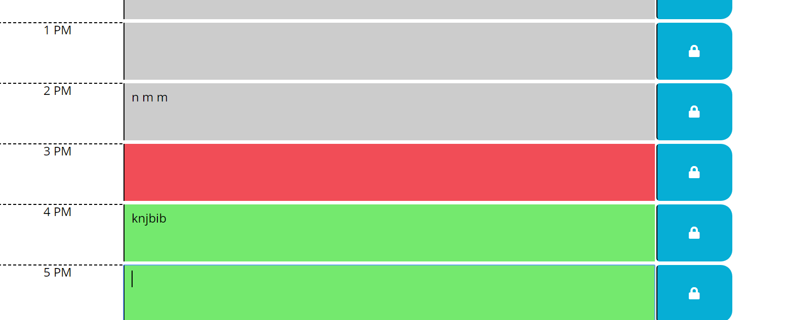

# Unit 05 Third-Party APIs Homework: Day Planner

Name:
Day Planner

Description:
Create a simple calendar application that allows the user to save events for each hour of the day. This app will run in the browser and feature dynamically updated HTML and CSS powered by jQuery.

The app should display standard business hours (9 a.m. to 5 p.m.). Each time slot should represent one hour and contain the following:

* The time

* A field to hold user input

* A save button

Clicking on the save button will store the time and user input in `localStorage`.

Near the top of the calendar, the application should display the current day. Additionally, each hour should be color coded to reflect whether the time slot is in the past, the present, or the future. This will change depending on the time of day.

YWe use the [Moment.js](https://momentjs.com/) library to work with date and time. Be sure to read the documentation carefully and concentrate on using Moment.js in the browser.

 Screenshots:

 
 

Installation:

This webpage is available as my github page whose link is https://saranyav91.github.io/day_planner/

Usage:

This is, as mentioned earlier, a day planner web application. Also, this webpage can be accessed from different devices of varied resolutions, whithout any issue in the page outlook and navigation.

Support:

Contact me, Saranya Vasudevan at sara.29891@gmail.com

